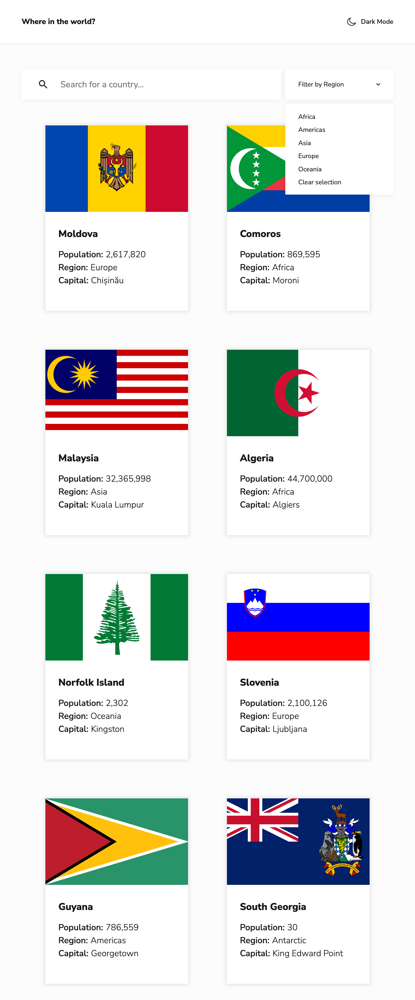
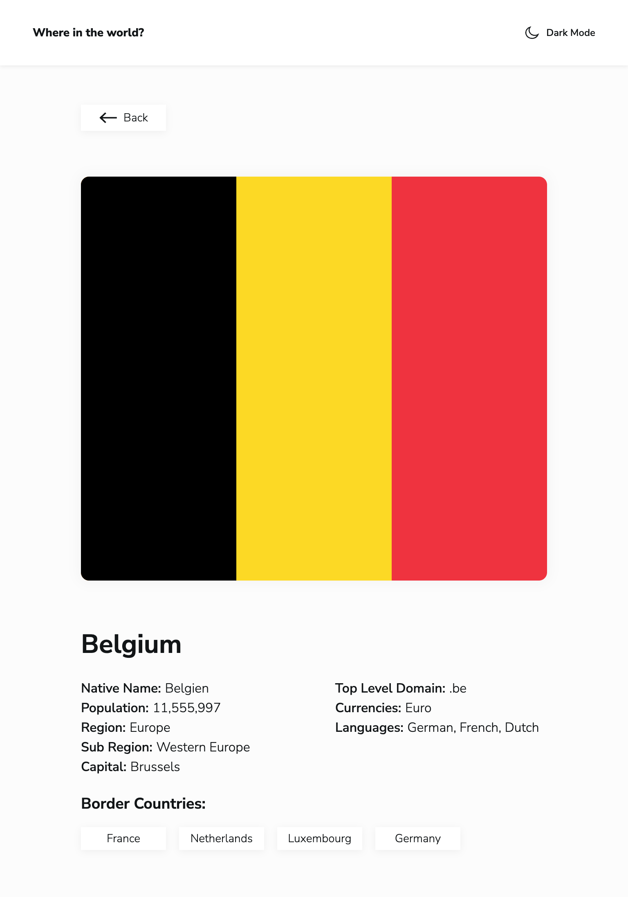

# Frontend Mentor - REST Countries API with color theme switcher solution

This is a solution to the [REST Countries API with color theme switcher challenge on Frontend Mentor](https://www.frontendmentor.io/challenges/rest-countries-api-with-color-theme-switcher-5cacc469fec04111f7b848ca). Frontend Mentor challenges help you improve your coding skills by building realistic projects.

I completed this challenge as part of the [JavaScript frameworks and libraries](https://www.frontendmentor.io/learning-paths/javascript-frameworks-and-libraries-JDWoqQjMyb) Frontend Mentor learning path. This continues my efforts to learn my chosen JS Framework - [Vue.js](https://vuejs.org/) + [Pinia](https://pinia.vuejs.org/). And now the goal is to specifically learn to work with routing.

## Table of contents

- [Overview](#overview)
  - [The challenge](#the-challenge)
  - [Screenshots](#screenshots)
  - [Links](#links)
- [My process](#my-process)
  - [Built with](#built-with)
  - [What I learned](#what-i-learned)
  - [Continued development](#continued-development)
  - [Useful resources](#useful-resources)
- [Author](#author)

## Overview

### The challenge

Users should be able to:

- See all countries from the API on the homepage
- Search for a country using an `input` field
- Filter countries by region
- Click on a country to see more detailed information on a separate page
- Click through to the border countries on the detail page
- Toggle the color scheme between light and dark mode _(optional)_

### Screenshots

|               Mobile designed at 375px:               |              Tablet designed at 1440px:               | Desktop designed at 1440px:                            |
| :---------------------------------------------------: | :---------------------------------------------------: | ------------------------------------------------------ |
|   |   |   |
|    |    |    |
|  |  |  |
|   |   |   |

### Links

- Solution URL: [https://github.com/elisilk/rest-countries](https://github.com/elisilk/rest-countries)
- Live Site URL: [https://elisilk.github.io/rest-countries/](https://elisilk.github.io/rest-countries/)

## My process

### Built with

- Semantic HTML5 markup
- CSS custom properties
- Flexbox
- CSS Grid
- Mobile-first workflow
- Accessibility
- [Vite](https://vite.dev/)
- [Vue](https://vuejs.org/)
- [Pinia](https://pinia.vuejs.org/)
- [Vue Router](https://router.vuejs.org/)

### What I learned

As always, so many cool :sunglasses: things. Here are some of the key resources I used:

- [REST Countries API](https://restcountries.com/)
  - [restcountries on GitLab](https://gitlab.com/restcountries/restcountries)
  - [REST Countries Typed API Package - Available Fields](https://www.npmjs.com/package/@yusifaliyevpro/countries#available-fields)
  - [FIELDS.md](https://gitlab.com/restcountries/restcountries/-/blob/master/FIELDS.md)
  - [the "all" endpoints will return 400 if no fields are specified](https://gitlab.com/restcountries/restcountries/-/issues/265)
- Vue + API
  - [Leveraging Pinia to simplify complex Vue state management](https://blog.logrocket.com/complex-vue-3-state-management-pinia/)
  - [Pinia store: Initial data fetching on store creation](https://stackoverflow.com/questions/77427537/pinia-store-initial-data-fetching-on-store-creation)
- General Routing
  - [Frontend Mentor - Routing](https://www.frontendmentor.io/learning-paths/javascript-frameworks-and-libraries-JDWoqQjMyb/steps/6865321618424bc8ee8e0115/article/read)
  - [Single Page Application Routing Using Hash or URL](https://dev.to/thedevdrawer/single-page-application-routing-using-hash-or-url-9jh)
  - [Understanding single page apps & client-side routing](https://bholmes.dev/blog/spas-clientside-routing/)
  - [What is a URL?](https://developer.mozilla.org/en-US/docs/Learn_web_development/Howto/Web_mechanics/What_is_a_URL)
- [Vue Router](https://router.vuejs.org/)
  - [Getting Started](https://router.vuejs.org/guide/)
  - [Data Fetching](https://router.vuejs.org/guide/advanced/data-fetching.html)
  - [Programmatic Navigation](https://router.vuejs.org/guide/essentials/navigation)
    - [How can I go back/route-back on vue-router?](https://stackoverflow.com/questions/48104842/how-can-i-go-back-route-back-on-vue-router)
  - [Lazy Loading Routes](https://router.vuejs.org/guide/advanced/lazy-loading.html)
  - [Different History modes](https://router.vuejs.org/guide/essentials/history-mode)
  - [Dynamic Route Matching with Params](https://router.vuejs.org/guide/essentials/dynamic-matching)
- Vue Routing - Tutorials and Practical Examples

  - [Vue Router 4 for Everyone: Master Routing in Vue.js](https://vueschool.io/courses/vue-router-4-for-everyone) - Some especially helpful videos and overall a great example walkthrough
    - [Reacting to Param Changes](https://vueschool.io/lessons/reacting-to-param-changes)
    - [Dynamic Routes](https://vueschool.io/lessons/dynamic-routes)
  - [What is <router-view :key="$route.fullPath">?](https://stackoverflow.com/questions/52847979/what-is-router-view-key-route-fullpath)

- Vue File Structure
  - [Mastering Vue Components Folder Structure for Scalable Apps](https://vueschool.io/articles/vuejs-tutorials/structuring-vue-components/)
  - [How to Efficiently Structure a Medium-Sized Vue 3 Project](https://medium.com/@mohandabdiche/building-efficient-frontends-a-vue-3-blueprint-for-modern-medium-sized-applications-671dd403ca62)
- Theme Switcher
  - [The best light/dark mode theme toggle in JavaScript](https://dev.to/whitep4nth3r/the-best-lightdark-mode-theme-toggle-in-javascript-368f)
  - [Creating a Dynamic Theme Switcher in Vue 3 with CSS Variables](https://medium.com/@sj.anyway/creating-a-dynamic-theme-switcher-in-vue-3-with-css-variables-ac06219e860d)
  - [Detect user color scheme preference in JavaScript](https://www.30secondsofcode.org/js/s/prefers-color-scheme/)
  - [Understanding window.matchMedia: A Key Tool for Responsive Web Design](https://medium.com/@nadeem.ahmad.na/understanding-window-matchmedia-a-key-tool-for-responsive-web-design-25966c3538e3)
  - [MDN `prefers-color-scheme`](https://developer.mozilla.org/en-US/docs/Web/CSS/@media/prefers-color-scheme)
  - [MDN `color-scheme`](https://developer.mozilla.org/en-US/docs/Web/CSS/color-scheme)
  - [MDN `<meta name="color-scheme">`](https://developer.mozilla.org/en-US/docs/Web/HTML/Reference/Elements/meta/name/color-scheme)
  - [MDN `light-dark()`](https://developer.mozilla.org/en-US/docs/Web/CSS/color_value/light-dark)
  - [CSS tricks `color-scheme`](https://css-tricks.com/almanac/properties/c/color-scheme/)
  - [CSS tricks `light-dark()`](https://css-tricks.com/almanac/functions/l/light-dark/)
    - [CodePen `light-dark()` code example - light and dark mode toggle](https://codepen.io/sunkanmii-the-styleful/pen/MYgWyPr)
- Custom select dropdown
  - [Creating a custom `<select>` dropdown with CSS](https://blog.logrocket.com/creating-custom-select-dropdown-css/)
    - [custom select dropdown with CSS + JS](https://codepen.io/ibaslogic/pen/NPKdday?editors=0010)
  - [`<select>`: The HTML Select element](https://developer.mozilla.org/en-US/docs/Web/HTML/Reference/Elements/select)
  - [ARIA APG Menu Button Pattern](https://www.w3.org/WAI/ARIA/apg/patterns/menu-button/)
  - [ARIA: listbox role](https://developer.mozilla.org/en-US/docs/Web/Accessibility/ARIA/Reference/Roles/listbox_role)
  - [ARIA: option role](https://developer.mozilla.org/en-US/docs/Web/Accessibility/ARIA/Reference/Roles/option_role)
  - [An accessible custom dropdown menu in Vue.js](https://negativespacestudios.com/articles/2021/01/20/an-accessible-custom-dropdown-menu-in-vue-js/)
    - [Vue.js accessible dropdown menu](https://codesandbox.io/p/sandbox/vuejs-accessible-dropdown-menu-r9ngf)
  - [Customizable select elements](https://developer.mozilla.org/en-US/docs/Learn_web_development/Extensions/Forms/Customizable_select)
- [Vue](https://vuejs.org/)
  - [List Rendering](https://vuejs.org/guide/essentials/list.html)
  - [Event Handling](https://vuejs.org/guide/essentials/event-handling)
  - [Template Refs](https://vuejs.org/guide/essentials/template-refs)
    - [How to access DOM elements with useTemplateRef](https://michaelnthiessen.com/how-to-access-dom-elements-with-usetemplateref)
  - [Composition API: Lifecycle Hooks](https://vuejs.org/api/composition-api-lifecycle.html)
  - [Form Input Bindings > Text](https://vuejs.org/guide/essentials/forms#text)
  - [Form Input Bindings > Select Options](https://vuejs.org/guide/essentials/forms#select-options)
  - [Vue Mastery Cheatsheets](https://www.vuemastery.com/vue-cheat-sheet/)
- [Pinia](https://pinia.vuejs.org/)
  - [Pinia Playground To Do App](https://play.pinia.vuejs.org/#eNqtVs1y2zYQfpU1L5QdmUzGbQ4cyWO3k86kh7STuKcwB4pcWohBgMWPbI/KN+kD9Ln6JF0A/JPs8WTaXkSB2P32w7eLXe6j67ZNdhajLFrpUrHWgEZj28tcsKaVysAeFNbQQa1kAzGZxrMtbaTCG/kRaz2atEywYm5kNZlUcrJIUuPWyVdNZrkopdAG/KtPDg/Wo8vidNjeQ824QbXsn1gNmOs5i8UEQ66Ds8B7Z32DD4bM6TyLOPbbtRWlYVJAUXm8xSnscwHAaliczLySXcEt9ptACMYqcgfoHArMyCcD0lNvZ/jkLfGJSQXCWaUhASQ9LQw2LS8M0gpgxYsN8ssVE601sDtvZIV8nUdBijwC89girVVRMUlLj0zrgvM8uoRrzldpgPgvaDUlVm+xcpA/9f//D1wr5si/jasD7K0KTxvWLhqjGLVUhODkByYOS4MiZHf42G8nzKEHV3I+5hhM9HCsiWy5xfJuIx9mzvu9z3diXDl1lDmPmHIWGKY9xV6OsP0B78Gxynrr4/izuphiuwC0uqJTtAq1TlDQ8VxeQ431nA502lhjqJ6ziuliw7Ei63khO7iSs/LuAOW6IrGDJ6Gs0rH4omUUrvF5U7R0X6WgRuEvQd5vkMzZcC3yyN999yaPUv8/Qd2cb5S816jIP4+Wg+kVtZK0wp2RkuvzomXBbWtMq7M0LStB9iQO26lEoElF26RPfK7eJt8nb0j6TUqBUiYqfDgMQx7nFTbfgj6YXr1O3nyXvPWou4setHGo/Y3vSBajqbXU7PZIlFI2LeOofmldWzkUh26jvP/ZvzPK4kjRl9gz779qqjrH+ldKPqodzo5lCnWLlE23/e7TB5/ZcZOKynKyfmHzI2rJreMYzH6woiLaMzvP9r3PMRO3N/rdg0Ghh0M5ol4Nb+9l/vGFo090L5KLuYr9HCABx3FRITUADJPgeKbkAh+8Wejr42RZz70WsYeNlyG+NlTJGVBrX1/CoqeUnp3Blbtm/jaTQhnZKTroEliVgbDNxs2aqSNksKGiw0JA9/lLB2dpwPGRMvj8pddthhuTgjH8AfHQz/xianbxhBL6VgbeZUBKfRuAe8Y5bBAKa2RTGFaSzSM1uxoVdToi0JMNXqSPeU9kX3uU7tQ/SHqCJ5r94QcGYcR6fcbR5gO7WK6SObpUnsDff/417IbRF0RNQvoC+4UfvV7ko2bqB99QKgCTAs/H/5YIJy+HoCz0aJSNgKf/XaIHGErU74Ge/zYwWzawgvWaRviY1NlBvJQuXSDNlgz7NFBGzfZI4rnCowJ9kJlWg0kHyDU+z2RWYAdc5qBHKRhhj1LgbX0G5vKG38J/N0015apGPELRSCsMyBroxtuGBpZeDnAFtHSZGRGXCoQ0wXH4XnK5OazCR2lJPgEVU1gaKvrGupogWhiqY7CdeCat1dtFSHRIsN8Lt+LVq8M814UTsTuoHffbnUbdPxMhtgg=)
- [`Intl.NumberFormat()`](https://developer.mozilla.org/en-US/docs/Web/JavaScript/Reference/Global_Objects/Intl/NumberFormat/NumberFormat)
- [`<dl>`: The Description List element](https://developer.mozilla.org/en-US/docs/Web/HTML/Reference/Elements/dl)
- [`<input type="search">`](https://developer.mozilla.org/en-US/docs/Web/HTML/Reference/Elements/input/search)
- [Document: `documentElement` property](https://developer.mozilla.org/en-US/docs/Web/API/Document/documentElement)
- [Auto-Sizing Columns in CSS Grid: `auto-fill` vs `auto-fit`](https://css-tricks.com/auto-sizing-columns-css-grid-auto-fill-vs-auto-fit/)
- Card Component
  - [Inclusive Components - Cards](https://inclusive-components.design/cards/)
  - [Is HTML the hardest language?](https://www.youtube.com/watch?v=PGvgdZuQu6w&ab_channel=KevinPowell)
- Sticky Header
  - [One Line - Sticky Header using CSS](https://dev.to/akhilarjun/one-line-sticky-header-using-css-5gp3)
  - [One line CSS solution to prevent anchor links from scrolling behind a sticky or fixed header](https://getpublii.com/blog/one-line-css-solution-to-prevent-anchor-links-from-scrolling-behind-a-sticky-header.html)
    - [`scroll-margin-top`](https://developer.mozilla.org/en-US/docs/Web/CSS/scroll-margin-top)
    - [`scroll-padding-top`](https://developer.mozilla.org/en-US/docs/Web/CSS/scroll-padding-top)
  - [How to Create a “Skip to Content” Link](https://css-tricks.com/how-to-create-a-skip-to-content-link/)
- JavaScript
  - [Check if a variable is a string in JavaScript](https://stackoverflow.com/questions/4059147/check-if-a-variable-is-a-string-in-javascript)
  - [Javascript-searching for a string in the properties of an array of objects](https://stackoverflow.com/questions/47653927/javascript-searching-for-a-string-in-the-properties-of-an-array-of-objects)

### Continued development

Specific areas that the solution should be improved (known issues):

- [x] Fix sizing and styling of SVG icons
- [x] Fix styling of input and select elements
- [ ] Fix [frontend mentor solution screenshot](https://www.frontendmentor.io/solutions/rest-countries-api-with-theme-switcher-and-searchingfiltering-JRo5DcbyF4) so that the index shows the full listing of country cards rather than "loading..."

More general ideas I want to consider:

Hmm 🤔 ...

- [ ] Read and incorporate the Vue [Style Guide](https://vuejs.org/style-guide/) into the application
- [ ] Finish watching and learning from Vue School's [Vue Router 4 for Everyone: Master Routing in Vue.js](https://vueschool.io/courses/vue-router-4-for-everyone) course

### Useful resources

- [Vue Guide](https://vuejs.org/guide/)
- [Pinia Guide](https://pinia.vuejs.org/core-concepts/)
- [Vite Guide](https://vite.dev/guide/)
- [MDN Web Docs for CSS](https://developer.mozilla.org/en-US/docs/Web/CSS) - Went here a lot to reference the different CSS properties and the shorthands, and all the great explanations about best practices.

## Author

- Website - [Eli Silk](https://github.com/elisilk)
- Frontend Mentor - [@elisilk](https://www.frontendmentor.io/profile/elisilk)
